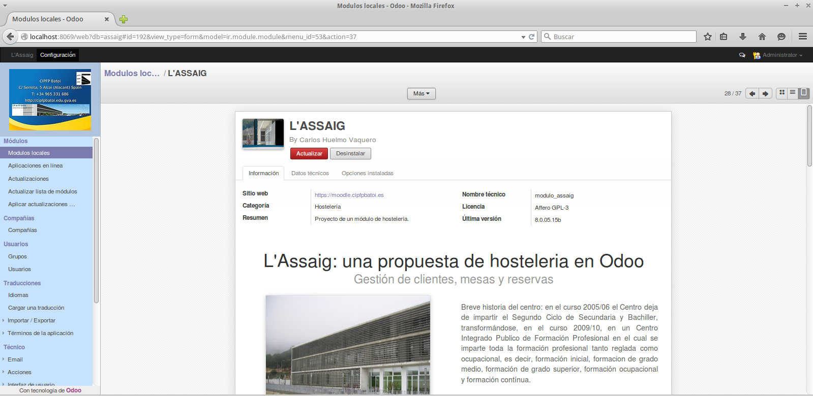
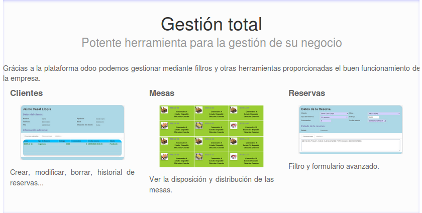
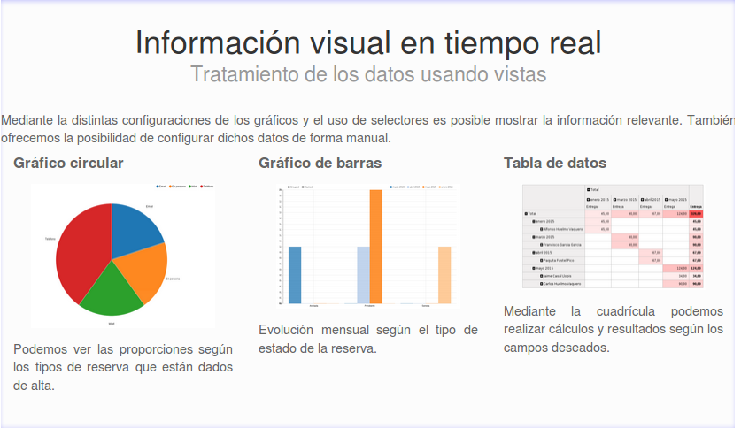
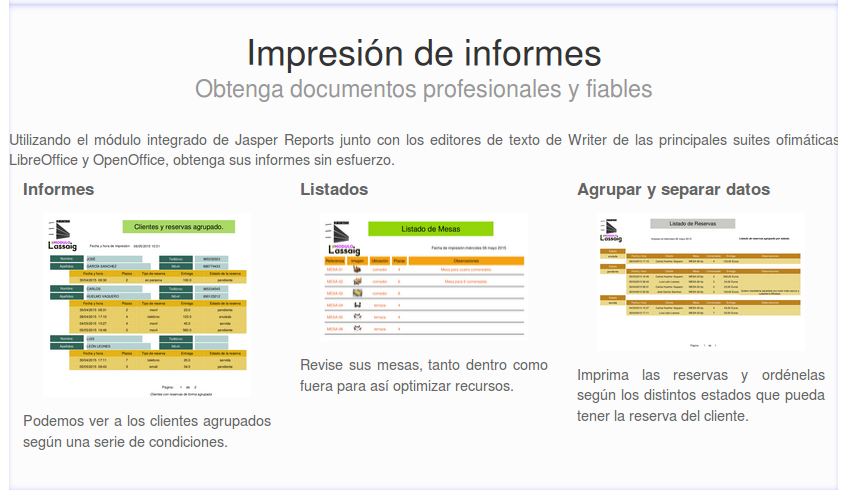

# Odoo 8
##Investigación, documentación y creación de un nuevo módulo de hosteleria en Odoo 8

###Proyecto final de curso de DAM. Año académico 2014 - 2015:

>Desde la dirección del centro nos han solicitado la creación de un módulo en OpenERP que gestione las mesas del restaurante L'Assaig y que además permita realizar reservas.

>Para la gestión de las mesas habrá que tener en cuenta la superfície útil para ubicarlas así como la capacidad tomada como referencia a la hora de acomodar a los clientes, disponibilidad de las mesas, seguridad y permisos para los usuarios del módulo.

